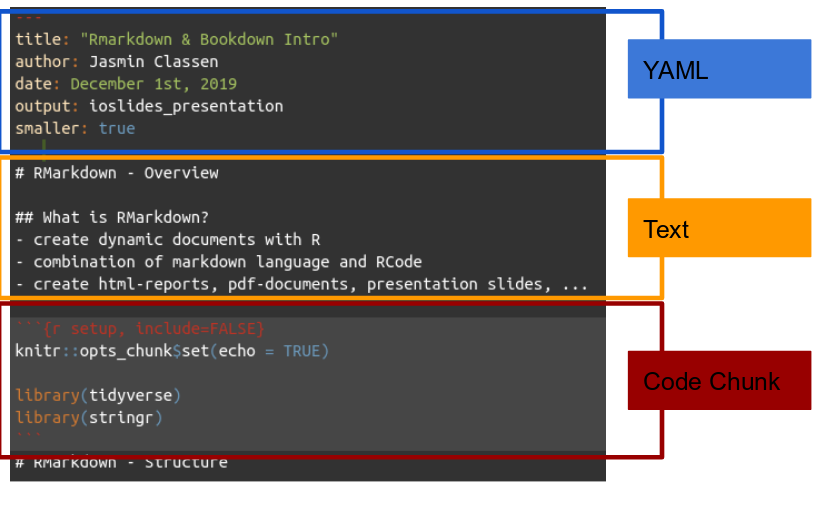

# RMarkdown - Overview
  
## What is RMarkdown?
- Create dynamic documents with R
- Combination of markdown language and RCode
- Create html-reports, pdf-documents, presentation slides, ...

# RMarkdown - Structure
## Three components


## YAML header
- Format entire document
- E.g. what output, style (custom css files), templates etc. 

```{r eval = F}
---
title: "Rmarkdown & Bookdown Intro"
author: Jasmin Classen
date: December 1st, 2019
output: ioslides_presentation
---
```

## Markdown-Syntax
- Markdown is a simple language that allows you to specify fonts, font style, headings and much more
- You can make text *italic* or **bold** using asterisks (*)
- Insert headings with hashtags (# for heading 1, ## for heading 2, ...)
- Make lists
  - with up to
    - 2 sub-levels
- More infos [here](https://bookdown.org/yihui/rmarkdown/markdown-syntax.html)


## Code Chunks
- Embed RCode and use it for anything you normally do
- Produce tables, plots or text output and embed it into your document

```{r}
# write a comment
print("Hello World!")
```

## Code Chunk Options
- At beginning of a new code chunk
- Fine grain output:
  - ```{r echo = FALSE}``` : evaluate code & show output, exclude code itself
  - ```{r include = FALSE}``` : evaluate code, exclude output & code itself
  - ```{r myplot, fig.height = 4}```: set height of a plot
- Many more chunk options [here](https://yihui.org/knitr/options/)

# Project Workflow
## R Projects
- Make project managment simple
- Restores your last RStudio session with all files used still open
- Access to R History from last session
- Own directory for each project 
  - no more ...
```{r eval = F}
setwd("C:Users\jasmin\afolder\anotherfolder\wowthisislong\
      morefolders\hereiwanttobe")
```
- Let's create our own RProject for our exercises now! 
- For more info on Project Workflow in R: [Jenny Bryan](https://rstats.wtf/project-oriented-workflow.html) is **the** expert and wrote a bunch of blog articles / talks about it

## Exercise 1: R Markdown Basics
Create a new R Markdown file and use it to transform the R Script **rmarkdown_bobross.R** provided into a better understandable report! 

# Writing Books with Bookdown
## Bookdown Intro
- Rpackage by Yihui Xie that enables writing books & long reports with RMarkdown
- Combines advantages of writing dynamic documents with features specifically important for longer projects:
  - Referencing
  - Cross-referencing of figures and tables
  - HTML, PDF and e-book output
  - Easy and clear structuring of chapters & sections
  
## Components / Structure I
- ```index.Rmd```
  - Contains YAML & other options to tell bookdown how to render your book
- ```.Rmd``` files (e.g. ```introduction.Rmd```, ```theory.Rmd```, ...)
  - "Normal" R Markdown-files containing the actual content of your book
  - Can be separated according chapters or whichever organization you find best
  - Will be compiled in *alphanumeric* order therefore take care of right naming
  - Using headers automatically determines structure (no need to mention filenames anyhwere else for structure)

## Components / Structure II
- ```references.bib```
  - Bib file with all your references
  - Used they same way like in LaTeX
  - Can be exportet from most common reference management tools
- ```data``` - folder contains all datasets used in your book
- ```scripts``` - folder contains all RScripts used in your book

## Compiling 
- YAML
- preamble.tex
- doc_preface.tex
- Render
  - Do not knit!
- **Exercise 2**: Let's render our first book!

```{r eval = F}
setwd("bookdown-demo-master") # as an exception we do this :D
library(bookdown)
bookdown::render_book("index.Rmd", "bookdown::pdf_book")
```
- Open _books/index.html in your browser. Tadaaa!

## Helpful Sources I {.smaller} 
  
#### RMarkdown Basics

- [R Markdonw Cheatsheet](https://rstudio.com/wp-content/uploads/2015/02/rmarkdown-cheatsheet.pdf)
- [R Markdown: The Definitive Guide](https://bookdown.org/yihui/rmarkdown/)
- [Markdown Basics](https://rmarkdown.rstudio.com/authoring_basics.html)

#### Bookdown:

- [bookdown: Authoring Books and Technical Documents with R Markdown](https://bookdown.org/yihui/bookdown/) (Yihui Xie)
- [Bookdown Template](https://github.com/rstudio/bookdown-demo) used in Yihui Xies Book and the corresponding minimal [bookdown example](https://bookdown.org/yihui/bookdown-demo/intro.html)
- [Writing Your Thesis in Bookdown](https://eddjberry.netlify.com/post/writing-your-thesis-with-bookdown/) (Ed D. J. Berry )
- [Making Books in R Markdown](https://arm.rbind.io/days/day1/bookdown/) (Alison Hill, 2019-01-16, rstudio::conf)
- [Dissertating with RMarkdonw and Bookdown](https://bookdown.org/connect/#/apps/2515/access)
- [Rticles: Templates for Journal-Articles](https://bookdown.org/yihui/rmarkdown/rticles-templates.html)
  
## Helpful Sources II {.smaller} 
#### Well known (open-source) books written in bookdown: 

- [R for Data Science](https://r4ds.had.co.nz/) (Hadley Wickham)
- [Efficient R programming](https://bookdown.org/csgillespie/efficientR/) (Colin Gillespie, Robin Lovelace)

#### Others:

- [Project-oriented workflow](https://www.tidyverse.org/blog/2017/12/workflow-vs-script/) (Jenny Bryan, December 2017)
- [Using R Projects](https://support.rstudio.com/hc/en-us/articles/200526207-Using-Projects)